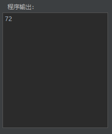

# Yuumi's Compiler

> version 1.2        by Yuumi        2022.11.7

[TOC]

该程序为smallC语言及其扩展的编译器实现，已上传[Github](https://github.com/Yuumi0221/SmallCCompiler)。重要文件结构如下：

```
code
│  README.md		// 此文档
│  TEST.md			// 测试说明文档
│  
├─myCompiler
│     myCompiler.pro	// QT文件
│          
├─release
│     c_o_d_e.txt		// 缓存代码
│     fcode.txt			// 缓存机器指令
│     finput.txt		// 缓存输入
│     foutput.txt		// 缓存是否成功
│     fresult.txt		// 缓存输出
│     ftable.txt		// 缓存符号表
│     myCompiler.exe	// 编译器GUI
│     smallC.exe		// 编译器本体
│     test_1.txt		// 测试文件1234
│     test_2.txt
│     test_3.txt
│     test_4.txt
│
└─smallC1.2
        c_o_d_e.txt		// 编译器测试代码
        smallC.exe		// 编译器本体
        smallC.l		// flex/lex文件
        smallC.y		// yacc/bison文件
```


## 程序使用

`release` 目录下的 `myCompiler.exe` 为程序的可执行文件，下文将介绍其[使用方法](#使用方法)。

### 运行环境

- Windows 64位操作系统

### 使用方法

1. **运行程序**：双击打开 `myCompiler.exe` ，看到界面，则运行成功。

	

2. **输入或导入代码**：可以选择在左侧上方的框中直接输入代码，或者点击打开按钮导入准备好的smallC语言代码文件。导入之后代码将显示在编辑框中，可以继续编辑。此处导入了求两个整数的最小公倍数代码。

	


3. **另存为代码**：点击另存为按钮后，编辑区的代码将被保存到用户选择的路径中。

4. **保存代码**：若用户另存为或导入过文件后点击保存按钮，则编辑区的代码都将保存在用户之前选择的文件中。若用户未另存为或导入文件，点击保存按钮后会将编辑框中的代码另存为到用户选择的路径。

5. **程序输入**：若编写的代码程序中有 `read id;` ，则需要在 `程序输入框` 中进行输入。若有多个输入，则需要在每个输入间插入空格，或者换行。该代码需要输入两个数字，此处输入了24和36。

	


6. **编译运行**：点击编译运行按钮，可以在右侧看到编译运行结果。

	


  1. 代表运行成功
  2. 代表程序中有错误，程序输出可能不正确，需要将错误全部修改才能得到正确输出。
  3. 为该程序的符号表
  4. 为该程序的机器指令代码
  5. 为该程序的输出结果。此处为24和36的最小公倍数：72。

### 测试方法

在 `release` 目录中有四个以 `test_x.txt` 为命名的测试文件。具体使用方法详情见 [TEST.md](TEST.md) 文件。


## 程序设计

该程序使用QT框架，flex & bison（即Windows版的 lex & yacc）编写。

### 开发环境

- QT 6.4.0
- MinGW 11.2.0
- flex 2.5.4
- bison 2.4.1
- C++ 11

### 编译器

smallC语言在语法上与C语言类似，要比C语言简单的多。它的所有变量都是整型变量。具有 `IF`, `WHILE` 等控制语句。注释用 `/*` 和 `*/` 括起来，但不能嵌套。表达式局限于布尔表达式和算术表达式。

#### smallC语言语法规则

基本的语法规则要求为：

```c
<program> ∷= {<declaration_list><statement_list>}

<declaration_list> ∷= <declaration_list><declaration_stat>|<declaration_stat>|ε
<declaration_stat> ∷= int ID;

<statement_list> ∷= <statement_list><statement>|<statement>|ε
<statement> ∷= <if_stat>|<while_stat>|<read_stat>|<write_stat>|<compound_stat>|<expression_stat>
<compound_stat> ∷= {<statement_list>}

<expression_stat> ∷= <expression>;|;
<expression> ∷= ID=<bool_expr>|<bool_expr>

<if_stat> ∷= if (<expression>) <statement> [else <statement>]
<while_stat> ∷= while (<expression>) <statement>
<write_stat> ∷= write <expression>;
<read_stat> ∷= read ID;

<bool_expr> ∷= <additive_expr>|<additive_expr>(>|<|>=|<=|==|!=)<additive_expr>
<additive_expr> ∷= <term>{(+|-)<term>}
<term> ∷= <factor>{(*|/)<factor>}
<factor> ∷= (<expression>)|ID|NUM
```

在此基础上，我增加了：

1. 增加运算符
	1. 求余运算符%
	2. 异或运算符XOR
	3. 判断整数的奇偶ODD
	4. 自增++，自减--
2. 增加语句，语法参照C语言
	1. for语句
	2. exit语句
	3. do…while语句
	4. repeat…until语句
3. 增加基本数据类型
	1. 可扩充到支持布尔数据类型，应支持and，or，not等布尔数据运算
4. 增加常量(const)的定义与使用，区分变量与常量

因此自行添加、修改了语法规则，修改后为：

```c
<program> ∷= {<const_decl><var_decl><statement>}

<const_decl> ∷= const <const_list>;|ε
<const_list> ∷= <const_def>|<const_list>,<const_def>
<const_def> ∷= ID=NUM

<var_decl> ∷= int <var_list>;|ε
<var_list> ∷= <var_def>|<var_list>,<var_def>
<var_def> ∷= ID

<statement_list> ∷= <statement_list><statement>|<statement>|ε
<statement> ∷= <if_stat>|<while_stat>|<read_stat>|<write_stat>|<compound_stat>|<expression_stat>|<exit_stat>|<for_stat>|<do_when_stat>|<repeat_until_stat>
<compound_stat> ∷= {<statement_list>}

<expression_stat> ∷= <expression>;|;
<expression> ∷= ID=<and_or_expr>|<and_or_expr>

<exit_stat> ∷= exit
<if_stat> ∷= if (<expression>) <statement> [else <statement>]
<while_stat> ∷= while (<expression>) <statement>
<do_when_stat> ∷= do <statement> when (<expression>)
<repeat_until_stat> ∷= repeat <statement> until (<expression>)
<for_stat> ∷= for (ID=<and_or_expr>|ε;<expression>;<expression>) <statement>
<write_stat> ∷= write <expression>;
<read_stat> ∷= read ID;

<and_or_expr> ∷= <bool_expr> {&& <bool_expr> | ||<bool_expr>}
<bool_expr> ∷= <additive_expr>|odd <additive_expr>|<additive_expr>(>|<|>=|<=|==|!=|^)<additive_expr>
<additive_expr> ∷= <term>{(+|-)<term>}
<term> ∷= <not_term>{(*|/|%)<not_term>}
<not_term> ∷= <factor>
<factor> ∷= [!] ID|NUM|(<expression>)
```

#### smallC语言语法图

根据 smallC 的 EBNF 文法，附加上自己添加的扩展点，画出以下 smallC 的语法图：


#### 判断是否符合两条限制规则

判断是否符合两条限制规则的方法为：

1. 找出图中每一个分支点，考察每个分支点的各个分支的头符号是否相异。
2. 找出图中每一个透明结构，考察每个透明结构的头符号集合与其跟随符号集合是否相异。

依照以上方法，自上而下，依次考察每一个语法图。

1. program

	没有分支点，也没有透明结构，无需讨论。

2. const_decl

	分支点的各个分支的头符号相异：ε 和 const 以及 ; 和 ,

	每个透明结构的头符号集合与其跟随符号集合相异：; 和 ,

3. var_decl

	分支点的各个分支的头符号相异：ε 和 int 以及 ; 和 ,

	每个透明结构的头符号集合与其跟随符号集合相异：; 和 ,

4. statement_list

	分支点的各个分支的头符号相异：ε 和 { if while read ; ID odd + - ! NUM ( exit for do repeat

	每个透明结构的头符号集合与其跟随符号集合相异：ε 和 { if while read ; ID odd + - ! NUM ( exit for do repeat

5. statement

	分支点的各个分支的头符号相异：{ 和 if 和 while 和 read 和 ; ID odd + - ! NUM ( 和 exit 和 for 和 do 和 repeat

	没有透明结构

6. compound_stat

	没有分支点，也没有透明结构，无需讨论。

7. expression_stat

	分支点的各个分支的头符号相异：; 和 ID odd + - ! NUM

	没有透明结构

8. expression

	分支点的各个分支的头符号相异：ID 和 odd + - ! NUM

	没有透明结构

9. exit_stat

	没有分支点，也没有透明结构，无需讨论。

10. if_stat

	分支点的各个分支的头符号相异：ε 和 else

	每个透明结构的头符号集合与其跟随符号集合相异：ε 和 else

11. while_stat

	没有分支点，也没有透明结构，无需讨论。

12. do_when_stat

	没有分支点，也没有透明结构，无需讨论。

13. repeat_until_stat

	没有分支点，也没有透明结构，无需讨论。

14. for_stat

	分支点的各个分支的头符号相异：ε 和 ID

	每个透明结构的头符号集合与其跟随符号集合相异：; 和 ID

15. read_stat

	没有分支点，也没有透明结构，无需讨论。

16. write_stat

	没有分支点，也没有透明结构，无需讨论。

17. and_or_expr

	分支点的各个分支的头符号相异：ε 和 && 和 ||

	每个透明结构的头符号集合与其跟随符号集合相异：ε 和 && 和 ||

18. bool_expr

	分支点的各个分支的头符号相异：odd 和 + - ! ID NUM ( 以及 ε 和 < 和 ≤ 和 > 和 ≥ 和 == 和 != 和 ^

	每个透明结构的头符号集合与其跟随符号集合相异：ε 和 < 和 ≤ 和 > 和 ≥ 和 == 和 != 和 ^

19. additive_expr

	分支点的各个分支的头符号相异：ε 和 + -

	每个透明结构的头符号集合与其跟随符号集合相异：+ - 和 ! ID NUM ( 以及 ε 和 + -

20. term

	分支点的各个分支的头符号相异：ε 和 * 和 / 和 %

	每个透明结构的头符号集合与其跟随符号集合相异：ε 和 * 和 / 和 %

21. factor

	分支点的各个分支的头符号相异：ε 和 ! 以及 ε 和 ++ 和 -- 以及 ID 和 NUM 和 (

	每个透明结构的头符号集合与其跟随符号集合相异：ID 和 ! 以及 ε 和 ++ 和 --

#### 程序总体结构

编译程序总的框架图如下：


该编译程序的总体结构由以下几个部分组成：词法分析器、语法分析器、语义分析与中间代码生成器、目标代码生成器、表格管理、出错处理。

#### 语法出错表定义

| 错误号 | 错误原因           |
| ------ | ------------------ |
| 1      | 该标识符没有说明   |
| 2      | 丢了一个分号       |
| 3      | 这里必须是一个变量 |
| 4      | 这里不允许为常量   |

### 虚拟机

#### 虚拟机组织结构

虚拟机的计算机结构由两个存储器、一个指令寄存器、三个地址寄存器组成。程序存储器 code 用来存放通过编译产生的中间代码程序（目标程序）。数据存储器 s 被当成数据栈（stack）使用。所有的算数和关系操作符都从栈顶找到它的操作数，又以计算结果取而代之。栈顶数据单元的地址用地址寄存器 t（top）标记。数据存储器 s 只有在代码程序被解释执行时才开始使用。指令寄存器 i 含有正在解释的指令。程序地址寄存器 p 含有下一条要从程序存储器取得的、被解释执行指令的地址。

1. 程序存储器 code

	```
	code: array [0..cxmax] of instruction;
	fct = (lit, opr, lod, sto, cal, int, jmp, jpc);
	instruction = packed record
						f: fct;
						l: 0..levmax;
						a: 0..amax;
					end;
	```

2. 数据存储器 s

	```
	s: array [1..stacksize] of integer;
	```

3. 程序地址寄存器 p

	```
	p: integer;
	```

4. 地址寄存器 t

	```
	t: integer;
	```

5. 指令寄存器 i

	```
	i: instruction;
	```

6. 基本地址寄存器 b

	```
	b: integer;
	```

#### 虚拟机指令格式

虚拟机指令以三元组为基本格式

1. `LIT` 指令：把一个常数置入栈顶。
2. `LOD` 指令：把一个变量置入栈顶。
3. `STO` 指令：从栈顶把数置入到一个变量单元里。
4. `JMP` 指令：程序无条件转移指令。
5. `JPC` 和 `JPN` 指令：程序有条件转移指令。
6. `OPR` 指令：一组算数和关系运算指令。

#### 虚拟机指令系统及其解释

| 序号 | 指令     | 实现解释的PASCAL语句                                | 说明                                         |
| ---- | -------- | --------------------------------------------------- | -------------------------------------------- |
| 1    | LIT 0, a | t := t + 1;<br />s[t] := a;                         | 将数 a 置入栈顶                              |
| 2    | LOD l, a | t := t + 1;<br />s[t] := s[base(l) + a];            | 将 l, a 形成的栈地址变量值置入栈顶           |
| 3    | STO l, a | s[base(l) + a] := s[t];<br />t := t - 1;            | 将栈顶值存到由 l, a 形成的栈地址变量         |
| 4    | JMP 0, a | p := a;                                             | 无条件转移                                   |
| 5    | JPC 0, a | if s(t) = 0 then<br />    p := a;<br />t := t - 1;  | 条件转移                                     |
| 6    | JPN 0, a | if s(t) <> 0 then<br />    p := a;<br />t := t - 1; | 条件转移                                     |
| 7    | OPR 0, a |                                                     | 一组算数关系运算符                           |
|      | 当 a=0   | t := b - 1;<br />p := s[t + 3];<br />b := s[t + 2]; | 函数调用结束后返回                           |
|      | 当 a=1   | s[t] := - s[t];                                     | 栈顶元素取反                                 |
|      | 当 a=2   | t := t - 1;<br />s[t] := s[t] + s[t + 1];           | 次栈顶项加上栈顶项，退两个栈元素，相加值进栈 |
|      | 当 a=3   | t := t - 1;<br/>s[t] := s[t] - s[t + 1];            | 次栈顶项减去栈顶项                           |
|      | 当 a=4   | t := t - 1;<br/>s[t] := s[t] * s[t + 1];            | 次栈顶项乘以栈顶项                           |
|      | 当 a=5   | t := t - 1;<br/>s[t] := s[t] div s[t + 1];          | 次栈顶项除以栈顶项                           |
|      | 当 a=6   | s[t] := ord(odd(s[t]));                             | 栈顶元素的奇偶判断                           |
|      | 当 a=7   | s[t] := !s[t];                                      | 栈顶元素取非                                 |
|      | 当 a=8   | t := t - 1;<br/>s[t] := ord(s[t] = s[t + 1]);       | 次栈顶项与栈顶项是否相等                     |
|      | 当 a=9   | t = t - 1;<br/>s[t] = ord(s[t] <> s[t + 1]);        | 次栈顶项与栈顶项是否不等                     |
|      | 当 a=10  | t := t - 1;<br/>s[t] := ord(s[t] < s[t + 1]);       | 次栈顶项是否小于栈顶项                       |
|      | 当 a=11  | t := t - 1;<br/>s[t] := ord(s[t] >= s[t + 1]);      | 次栈顶项是否大于等于栈顶项                   |
|      | 当 a=12  | t := t - 1;<br/>s[t] := ord(s[t] > s[t + 1]);       | 次栈顶项是否大于栈顶项                       |
|      | 当 a=13  | t := t - 1;<br/>s[t] := ord(s[t] <= s[t + 1]);      | 次栈顶项是否小于等于栈顶项                   |
|      | 当 a=14  | write(s[t]);<br/>t := t - 1;                        | 栈顶值输出                                   |
|      | 当 a=15  | write("\n");                                        | 输出换行符                                   |
|      | 当 a=16  | t := t + 1;<br/>read(s[t]);                         | 读入一个输入置于栈顶                         |
|      | 当 a=17  | t := t - 1;<br/>s[t] := s[t] mod s[t + 1];          | 次栈顶项模栈顶项                             |
|      | 当 a=18  | t := t - 1;<br/>s[t] := s[t] xor s[t + 1];          | 次栈顶项异或栈顶项                           |
|      | 当 a=19  | s[t] := s[t] + 1;                                   | 栈顶元素自增1                                |
|      | 当 a=20  | s[t] := s[t] - 1;                                   | 栈顶元素自减1                                |
|      | 当 a=21  | t := t - 1;<br/>s[t] := (s[t] and s[t + 1]);        | 次栈顶项与栈顶项逻辑与                       |
|      | 当 a=22  | t := t - 1;<br />s[t] := (s[t] or s[t + 1]);        | 次栈顶项与栈顶项逻辑或                       |

### 模块架构

该编译程序由以下几个模块组成：词法分析器、语法分析器、语义分析与中间代码生成器、目标代码生成器、表格管理、出错处理。

#### 模块功能介绍

1. 词法分析器

	输入源程序，进行词法分析，输出单词符号串。由子程序 getch 和 getsym 实现。

2. 语法分析器

	对单词符号串进行语法分析（根据语法规则进行推导或归约），识别出各类语法单位，最终判断输入的符号串是否构成语法上正确的程序。

3. 语义分析与中间代码产生器

	对语法分析器归约出（或推导出）的语法单位进行语义分析并把它们翻译成一定形式的中间代码。词法分析和中间代码产生器被调用穿插于语法分析程序中。

4. 目标代码生成器

	把中间代码翻译成目标程序。

5. 表格管理

	管理标识符表来登记源程序中出现的每个标识符及其各种属性。在程序说明部分遇到标识符时，要把标识符及其属性登记到标识符表中；在程序处理部分遇到标识符时，要到标识符表中去查证标识符及其属性。

6. 出错处理

	如果源程序有语法错误，编译程序会通过出错处理程序设法发现错误，指名错误所在位置，并把有关错误信息报告给用户。将错误造成的影响限制在尽可能小的范围内，使得源程序的其余部分能继续被编译下去，以便进一步发现其他可能的错误。

#### 模块接口

1. 词法分析器：getsym函数，获取源程序中的词。
2. 语法分析器：sym变量，保存词法分析所获得的词。
3. 语义分析与中间代码产生器：code数组，保存语法分析获得的代码。

### 全局数据结构、常量和变量

#### 全局数据结构

| 数据结构名  | 数据结构         | 含义                                  |
| ----------- | ---------------- | ------------------------------------- |
| tablestruct | char name[al]    | 名字                                  |
|             | enum object kind | 类型：const，var                      |
|             | int val          | 数值，仅const使用                     |
|             | int level        | 所处层，仅const不使用                 |
|             | int adr          | 地址，仅const不使用                   |
|             | int size         | 需要分配的数据区空间, 仅procedure使用 |
| instruction | enum fct f;      | 虚拟机代码指令                        |
|             | int l;           | 引用层与声明层的层次差                |
|             | int a;           | 根据f的不同而不同                     |

#### 全局常量

| 常量名    | 常量值 | 常量含义                    |
| --------- | ------ | --------------------------- |
| txmax     | 100    | 符号表容量                  |
| al        | 10     | 标识符的最大长度            |
| amax      | 2048   | 地址上界                    |
| cxmax     | 200    | 最多的虚拟机代码数          |
| stacksize | 500    | 运行时数据栈元素最多为500个 |

#### 全局变量

| 变量名  | 变量类型 | 变量含义                             |
| ------- | -------- | ------------------------------------ |
| tx      | int      | 符号表当前尾指针                     |
| cx      | int      | 虚拟机代码指针, 取值范围[0, cxmax-1] |
| px      | int      | 嵌套过程索引表proctable的指针        |
| lev     | int      | 层次记录                             |
| id[al]  | char     | 标识符数组                           |
| fin     | FILE*    | 输入源文件                           |
| ftable  | FILE*    | 输出符号表                           |
| fcode   | FILE*    | 输出虚拟机代码                       |
| foutput | FILE*    | 输出出错示意（如有错）               |
| fresult | FILE*    | 输出执行结果                         |
| finput  | FILE*    | 输入内容                             |


### 函数原型

| 函数原型          | 参数描述                         | 函数描述                            | 返回值                 |
| ----------------- | -------------------------------- | ----------------------------------- | ---------------------- |
| void yyerror      | char *s                          | 出错处理                            | 无                     |
| void getch        | 无                               | 过滤空格和注释，读取一个字符        | 无                     |
| void getsym       | 无                               | 词法分析，获得一个符号              | 无                     |
| void init         | 无                               | 初始化                              | 无                     |
| void enter        | enum object k                    | 在符号表中加入一项                  | 无                     |
| int position      | char *s                          | 查找标识符在符号表中的位置          | 标识符在符号表中的位置 |
| void setdx        | int n                            | 为本层变量分配相对地址，从3开始分配 | 无                     |
| void gen          | enum fct x<br />int y<br />int z | 生成虚拟机代码                      | 无                     |
| void listall      | 无                               | 输出所有目标代码                    | 无                     |
| void displaytable | 无                               | 输出符号表                          | 无                     |
| void interpret    | 无                               | 解释程序                            | 无                     |

